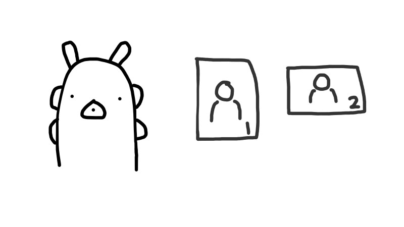
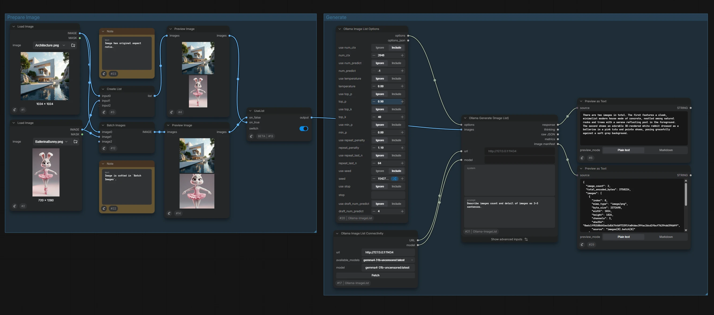
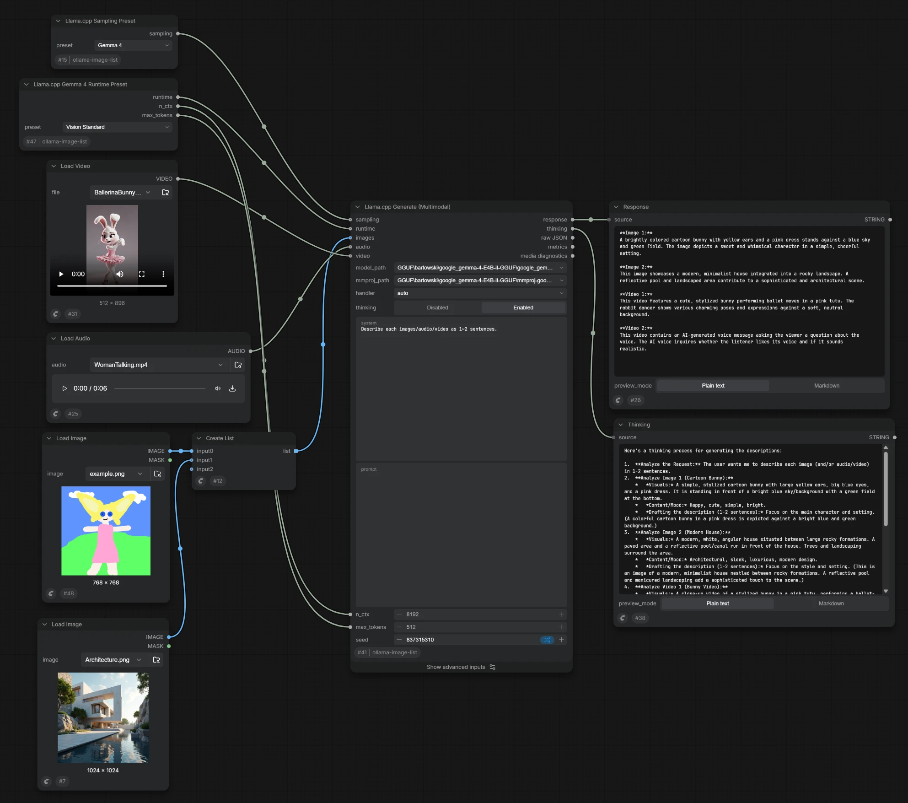

# ComfyUI-Ollama-ImageList



ComfyUI V3 custom nodes that analyze image lists through Ollama REST, a directly loaded `llama-cpp-python` GGUF model, or ComfyUI's native generative CLIP API. The llama.cpp and supported native CLIP models can additionally accept ComfyUI AUDIO and VIDEO. Batches, data lists, nested lists, and lists of batches are flattened deterministically while their traversal order is preserved.

## Nodes

Nodes are grouped by backend in ComfyUI's Add Node menu.

### Ollama / Image List



Workflow example: [Simple_Vision.json](./workflows/Simple_Vision.json)

- **Ollama Image List Connectivity** — fetches available models from an Ollama server and outputs the selected URL and model name.
- **Ollama Image List Options** — builds Generate-compatible options dictionary and JSON outputs from individually enabled Ollama runtime parameters.
- **Ollama Generate (Image List)** — sends the system prompt, user prompt, and all normalized images in one non-streaming request.

### Ollama / Multimodal

Workflow example: [Reference_Director.json](./workflows/Reference_Director.json)

- **Reference Director** — adds local image, audio, and video files to vertically stacked full-width boards; keeps independent visual and audio order; supports whole-card-surface reordering; attaches raw user captions; enables or disables each output; and applies non-destructive image crops, optional `rembg` foreground extraction, erase/restore masks, flips, backgrounds, and per-item audio/video trims.

The node emits seven outputs: `images`, `image_captions`, `audios`, `audio_captions`, `videos`, `video_captions`, and `manifest_json`. The first six are explicit ComfyUI data lists. Each media list and its caption list are index-aligned, while `manifest_json` records stable IDs, source hashes, enabled state, edits, derivation, and output order without embedding media payloads or inserting captions into a generation prompt.

Video follows the fixed `preserve` policy: its VIDEO value retains the source container's embedded audio, and enabling the card's audio channel also emits a separately decoded AUDIO item with the derived ID `<video-id>:audio`. A workflow that consumes both paths can therefore hear the soundtrack twice unless the downstream video consumer ignores embedded audio or the Director audio channel is disabled for that video.

Current per-workflow limits are 32 images, 8 standalone audio items, 4 videos, 256 MiB per source, 40 million decoded pixels per image, 16,384 characters per caption, two hours of decoded audio, 256 MiB per selected decoded AUDIO waveform, a 1 GiB aggregate IMAGE/AUDIO tensor budget, and one hour of video. Audio crops are selected while decoding instead of retaining the unselected source. Transparent image edits produce RGBA IMAGE tensors; choose a solid editor background when the downstream node requires RGB. An output may be an empty list when every item in that channel is disabled, so confirm that the receiving node accepts empty ComfyUI lists.

See [Reference Director](docs/REFERENCE_DIRECTOR.md) for usage, state and manifest contracts, storage/security behavior, compatibility, and a release smoke checklist.

### Ollama / prompt

- **MiniMax System Prompt Preset** — reads Markdown files from `presets/` and outputs a system prompt for I2V, FL2V, FL2V_LOOP, T2V, R2V, R2I, R2A, or L2V. R2V/R2I/R2A join `PROMPT_REFERENCE_BASE.md` with `PROMPT_<type>.md`; every other type joins `PROMPT_BASE.md` with its mode file. Each pair is separated by one blank line. The optional `enum_string` socket overrides the Combo when connected and rejects values that do not exactly match a preset name.

### Ollama / llama_cpp



Workflow example: [Native_Vision.json](./workflows/Native_Vision.json)

### Ollama / llama_cpp / compact

- **Llama.cpp Model Profile** — bundles model-dependent handler and sampling defaults, including `presence_penalty`; its Qwen 3.5 variants also select the matching thinking mode.
- **Llama.cpp Hardware Runtime Profile** — optionally overrides batch, offload, CPU, attention, and mmap settings; `n_ubatch=0` uses the backend default.
- **Llama.cpp Thinking / Reasoning Config** — controls `auto/off/on`, reasoning effort, and an optional reasoning-token limit for Generate.
- **Llama.cpp N-gram Speculative Config** — produces Generate's shared `speculative` connection with model-free prompt-history drafting.
- **Llama.cpp Generate** — requires a Model Profile and accepts optional Hardware Runtime, `reasoning`, and unified `speculative` inputs. A disconnected Hardware Runtime input uses GPU Full Offload.
- **Llama.cpp Sequential Generate** — loads Compact Generate once, resets llama.cpp context before every independent media item, returns explicit list outputs, and unloads after the complete sequence.

### Ollama / llama_cpp / experimental

- **Llama.cpp Native Speculative Config (Compat)** — supplies DFlash, DSpark, or Native MTP settings to Compact Generate's shared `speculative` input. The detailed experimental Generate implementation remains in the package but is not registered.

### Ollama / llama_cpp / utils

- **Llama.cpp Media Diagnostics** — expands Generate's typed MTMD receipt into capability flags, evaluated media counts, JSON, and formatted text.
- **Muse Glimmer Response Parser** — routes `to=user` content to `response`, `to=self` content to `thinking`, and other recipients or unclassified text to `raw`, followed by a `valid` completion flag.

### Hidden legacy nodes

`Llama.cpp Generate (Multimodal)`, Sampling Preset, Gemma 4 Runtime Preset, and
N-gram Speculative Preset remain registered under `Ollama / llama_cpp / legacy` so saved
workflows continue to load. Their V3 schemas are marked development-only, which hides
them from the add-node menu and search unless ComfyUI developer mode is enabled.

### Ollama / CLIP

- **CLIP Generate Text (Image List)** — extends ComfyUI's official Generate Text flow with a real system-role prompt, IMAGE data-list support, and automatic/manual Qwen3-VL, Qwen3.5, or Gemma 4 template selection.

The node calls the loaded CLIP's official `tokenize()`, `generate()`, and `decode()` methods; it does not load GGUF/mmproj files or implement another generation loop. Qwen image lists work with current upstream support. Gemma 4 lists with different resolutions activate automatically when the installed ComfyUI exposes the named `images` parameter proposed in [PR #15450](https://github.com/Comfy-Org/ComfyUI/pull/15450); older builds retain same-resolution IMAGE batch compatibility.

See [CLIP Generate Text support](docs/CLIP_GENERATE_TEXT.md) for template behavior, the support matrix, thinking behavior, and current modality restrictions.

## Install

Search `ollama-image-list` in `ComfyUI Manager's nodes manager` and install `Ollama-ImageList`.

Also you can clone this repository into `ComfyUI/custom_nodes`. Runtime dependencies are provided by ComfyUI.

The Comfy Registry package ID is `ollama-image-list`. Manual release archives use `ComfyUI-Ollama-ImageList-<version>.zip` and contain one top-level `ComfyUI-Ollama-ImageList` folder.

To run the development tests, sync the development environment:

```bash
uv sync --locked --group dev
```

Published packages and release archives already contain the compiled `web/index.js`; installing or running the custom node does **not** require Bun, Node.js, TypeScript, or Vite. Frontend contributors need Bun 1.3.14 or newer. The frontend uses strict TypeScript and Vite 8:

```bash
bun install --frozen-lockfile
bun run check:frontend
bun run dev       # type-check, then rebuild web/index.js on changes
bun run build     # production type-check and Vite build
```

### Ollama Nodes

The Ollama nodes require no additional Python package. They use Python's standard HTTP client and expect an Ollama server, which defaults to `http://127.0.0.1:11434`.

### llama_cpp Nodes

The llama.cpp backend is optional. Its nodes still register when `llama-cpp-python` is absent, but executing Generate reports that the optional dependency is unavailable. Install a compatible wheel into the exact Python environment that runs ComfyUI, then restart ComfyUI. This project deliberately does not declare it as a package dependency because automatic installation could compile or select an incompatible CPU-only or CUDA build. The MTMD-enabled fork used during development publishes Windows CUDA wheels at [JamePeng/llama-cpp-python releases](https://github.com/JamePeng/llama-cpp-python/releases). VIDEO requires a wheel built with `MTMD_VIDEO` support; no separate FFmpeg executable is required by this node.

See [Native llama.cpp backend](docs/LLAMA_CPP.md) for installation constraints, model layout, node wiring, preset values, modality behavior, and troubleshooting.

The experimental Speculative Generate node additionally requires a wheel that exposes `llama_cpp.llama_speculative.LlamaNativeSpeculativeDecoding`. If that API is missing, the Speculative Job stops immediately with an installation error before media processing or model loading; ComfyUI startup and other nodes remain available. See the [native speculative release notes](https://github.com/craftingmod/llama-cpp-python/releases/tag/v0.3.46-native-speculative.1). A prebuilt [CPython 3.13 / CUDA 13.2 / Windows x64 wheel](https://github.com/craftingmod/llama-cpp-python/releases/download/v0.3.46-native-speculative.1/llama_cpp_python-0.3.46-speculative-cp313-cu132-win_amd64.whl) is provided for that exact environment. Target and draft models must be compatible and may consume substantially more VRAM together; acceleration is not guaranteed.

## Input semantics

A ComfyUI IMAGE batch and a data list are different:

- A batch is one tensor shaped `[B,H,W,C]`; all entries normally share H×W.
- A data list is a list of independent values and may contain tensors with different H×W.

The nodes declare V3 `is_input_list=True`, so ComfyUI passes the complete data list to one execution instead of mapping the node over each item. The normalizer recursively splits every batch and preserves traversal order. Each image is independently encoded as PNG; it is never resized, cropped, padded, letterboxed, or combined into a montage.

The implementation follows ComfyUI's official [data list semantics](https://docs.comfy.org/custom-nodes/backend/lists) and [V3 migration/schema reference](https://docs.comfy.org/custom-nodes/v3_migration).

All scalar inputs (`url`, `model`, prompts, and options) must resolve to exactly one value. Supplying a data list of multiple prompts is an error rather than silently choosing one. Native CLIP images remain tensors and are passed to ComfyUI's resident tokenizer without PNG encoding.

## llama.cpp quick start

1. Install a compatible optional `llama-cpp-python` build in ComfyUI's Python environment.
2. Put the main model GGUF and its matching multimodal projector under `ComfyUI/models/LLM`, or register an `LLM` directory through `extra_model_paths.yaml`.
3. Add **Llama.cpp Generate (Multimodal)** from `Ollama / llama_cpp`, select the main GGUF and `mmproj`, and connect any IMAGE, AUDIO, or VIDEO inputs.
4. Optionally connect **Llama.cpp Sampling Preset**. For Gemma 4, connect the Runtime Preset's `runtime`, `n_ctx`, and `max_tokens` outputs to the matching Generate inputs. Connect **Llama.cpp N-gram Speculative Preset** to `ngram_speculative` when model-free prompt-history drafting is desired.
5. Connect `media_diagnostics` to **Llama.cpp Media Diagnostics** when verifying native ingestion.

For a smaller graph, use the nodes under `Ollama / llama_cpp / compact`. Connect
**Llama.cpp Model Profile** to **Llama.cpp Generate**. Its Hardware
Runtime input is optional and uses GPU Full Offload when disconnected; connect a Hardware
Runtime Profile only to override it. Context, output, and image-token budgets remain visible
on Generate; `image_max_tokens=0` uses the mmproj/handler default. Connect
**Llama.cpp Thinking / Reasoning Config** only when model-default reasoning behavior should
be overridden. Qwen 3.5 Thinking and Non-thinking profiles apply their named mode when this
socket is disconnected or `auto`, and reject an explicitly contradictory mode.
Optionally connect either Compact speculative config to the shared `speculative` socket.
The original Generate nodes remain available for per-parameter tuning and existing workflows.

All connected media lists are normalized into one user message and one chat completion. The node does not map one prompt over each list item. The model and projector are closed after that completion, including on failure.

## Ollama connectivity

The connectivity node contains `url`, `available_models`, and editable `model` widgets plus a **Fetch** button. It requests the model list when the node is created and whenever **Fetch** is pressed. Choosing an entry in `available_models` copies the exact name into `model`; the model field remains editable for names that are not currently reported by the server.

Model discovery is proxied through the ComfyUI server to Ollama's `GET /api/tags` endpoint, avoiding browser CORS restrictions. The node outputs independent `URL` and `model` strings that can be connected directly to the generate node.

## Ollama options

The options node exposes an **Include/Ignore** toggle followed by a typed value widget for each documented parameter. Disabled parameters are omitted rather than being sent with their displayed defaults. The inputs are ordered as `num_ctx`, `num_predict`, `temperature`, `top_p`, `top_k`, `min_p`, `repeat_penalty`, `repeat_last_n`, `seed`, `stop`, and `draft_num_predict`.

Connect the first `options` output directly to the generate node's `options` input for normal use. The second `options_json` output is provided for debugging, manual inspection, and string-based utility nodes. A selected `stop` string is encoded as the one-item array required by Ollama's HTTP API.

## Ollama request

The generate node creates one request with this logical structure:

```text
system message + user message + images[] -> POST /api/chat -> response/thinking/metrics
```

`system` is placed in a system-role message and `prompt` is placed in the current user-role message without trimming or rewriting. Images belong only to that request; this node does not create a persistent session or preserve them in later history.

Use the `options` dictionary input for Ollama generation options such as `temperature`, `top_p`, `top_k`, `min_p`, `seed`, `num_ctx`, `num_predict`, `repeat_penalty`, and `stop`. The advanced `options_json` field remains available as a manual fallback. If both are supplied, the connected dictionary takes precedence, including an empty dictionary. `format_json` accepts an empty value, the literal `json`, or a JSON Schema object.

Enable `unload_after_response` to send `keep_alive: 0`, which tells Ollama to unload the model as soon as the response is complete. This overrides the `keep_alive` input while enabled; when disabled, the configured keep-alive value is used as before.

To verify that a data list produced one request, enable Ollama server logging and look for one `POST /api/chat`, or enable the node's `debug` option and inspect the payload-free request manifest. The manifest includes counts, dimensions, byte sizes, hashes, and prompt character counts, but never base64 payloads or prompt text.

Model support for multiple images varies. If a model or server rejects a request, the node reports the backend error and does not resize, remove, montage, or split images into multiple calls.

Request and response fields follow Ollama's official [Chat API](https://docs.ollama.com/api/chat).

## llama.cpp request and unload behavior

`Llama.cpp Generate (Multimodal)` lists `.gguf` files recursively from every path registered under ComfyUI's `LLM` model category, including `LLM` entries loaded from `extra_model_paths.yaml`. The local `ComfyUI/models/LLM` directory is appended as a fallback. Duplicate absolute paths are removed while preserving ComfyUI's registered order. Both the main-model Combo and projector Combo expose the complete, unfiltered `.gguf` list; the projector Combo additionally provides `[none]` and stably prioritizes filenames containing `mmproj`. The selected relative names are resolved again through ComfyUI's `folder_paths` API at execution time, so a workflow cannot escape the registered model directories with a crafted relative path.

For image, audio, or video requests, choose the `mmproj` GGUF built for the exact main-model family and modality. `handler=auto` uses the fork's metadata-driven generic MTMD handler. Model-specific `gemma4`, `qwen3_vl`, `qwen25_vl`, and `qwen3_asr` handlers are available when a model requires specialized template or stop-token behavior.

`thinking` is an explicit Boolean request rather than a model-default mode. It maps to `enable_thinking` for Gemma 4, `force_reasoning` for Qwen 3 VL, and both template arguments for the generic MTMD path. A model or checkpoint without a compatible template switch may ignore it; in particular, the option cannot turn an Instruct-only checkpoint into a Thinking checkpoint.

`override_n_ubatch` and `override_image_max_tokens` control whether their adjacent integer widgets are passed to llama-cpp-python. With an override disabled, the integer is ignored and the backend or mmproj default remains authoritative. For image and video requests with an explicit image-token ceiling, the node validates `n_ctx`, `n_batch`, and the effective physical batch before loading the model. This prevents Gemma 4's non-causal vision encoder from reaching a native assertion when the image token chunk is larger than `n_ubatch`. A Gemma 4 ceiling of 1120 therefore also requires `n_batch>=1120` and an enabled `n_ubatch` override of at least 1120.

Connect `Llama.cpp Sampling Preset` to the optional `sampling` input to override `temperature`, `top_p`, `top_k`, `min_p`, and `repeat_penalty` together. While connected, those five Generate widgets are disabled but retain their values; disconnecting the preset makes the preserved values editable and authoritative again.

`Llama.cpp Gemma 4 Runtime Preset` places its typed `runtime` output first, followed by separate `n_ctx` and `max_tokens` integer outputs for direct connections to the Generate node's always-visible inputs. `runtime` overrides only the Advanced `n_batch`, `n_ubatch`, `image_max_tokens`, and two override switches. Those five widgets are disabled while `runtime` is connected without losing their values, then restored for editing when disconnected. This keeps context and output-length changes visible as graph connections while retaining one compact connection for the related multimodal batch settings. The profiles are named for Gemma 4 because their image-token and physical-batch values were selected for Gemma 4's dynamic-resolution vision encoder; other model families may need different values. `Vision Long / Thinking` reserves enough output room for reasoning but deliberately does not change the Generate node's explicit `thinking` Boolean.

The node intentionally has no model-loader output and no cache policy. Every execution follows this lifecycle:

```text
normalize media -> load GGUF/mmproj -> one chat completion -> Llama.close() -> garbage collection
```

Native executions are serialized so two ComfyUI branches cannot load separate llama.cpp models concurrently. Cleanup runs in `finally`, including when loading or generation raises an exception. `metrics_json.model_unloaded` confirms that explicit cleanup completed. The model, context, KV cache, and multimodal projector are not retained by this node; the loaded CUDA driver context and native DLLs may keep a small process-level baseline allocation until ComfyUI exits.

Input images are embedded as independent lossless PNG data URIs. ComfyUI AUDIO tensors are encoded as lossless PCM16 WAV payloads and attached as `input_audio`. A ComfyUI VIDEO object's original encoded stream is read without decoding it in Python and passed as an internal `video` content part containing a base64 data URI; this form is compatible with model-provided templates such as Gemma 4 that ignore `video_url`. The fork's native `libmtmd` video helper decodes the stream when `MTMD_VIDEO` was enabled at wheel build time. The node exposes only a `video` socket, not a URL widget. Embedded video audio is not ingested by llama.cpp's current video path, so connect AUDIO separately when the soundtrack is required. Media are placed in one multimodal user message in IMAGE, AUDIO, then VIDEO group order. `mmproj_path` is mandatory whenever any media are connected but may be `[none]` for text-only GGUF models. Use `gpu_layers=all` for normal GPU offload, and start with the context size recommended by the selected model.

The Generate node emits one typed `media_diagnostics` object rather than formatting diagnostics itself. Connect it to `Llama.cpp Media Diagnostics` to obtain `All Media Evaluated`, Vision/Audio/Video availability, evaluated IMAGE/AUDIO/VIDEO counts, full JSON, and a compact formatted receipt. With the supported fork, a successful `mtmd_evaluated` receipt means every requested media item passed capability checks, decoding, marker/chunk validation, and native MTMD evaluation. It does not claim that the language model interpreted the media correctly. Only payload-free metadata and hashes survive model cleanup; native handlers and pointers are never retained.

`Llama.cpp Native Speculative Config (Compat)` appears under `Ollama / llama_cpp / experimental`. Its draft selector uses `[none]` when no external draft is needed and prioritizes filenames containing `dflash`, `dspark`, `draft`, or `mtp` without treating filenames as a compatibility guarantee. Connect its output to Compact Generate. The older detailed `Llama.cpp Speculative Generate (Experimental)` class and backend implementation remain in the source tree for compatibility and testing, but the extension no longer registers that node.

The normal `Llama.cpp Generate (Multimodal)` node additionally accepts the typed `ngram_speculative` output from **Llama.cpp N-gram Speculative Preset**. Its detail widgets are disabled while `speculative_mode=off` but keep their configured values. N-gram mode uses `LlamaNGramMapDecoding` and repeated patterns from the current verified context; it requires no draft GGUF and little additional VRAM. It is most useful for code, JSON, templates, and boilerplate-heavy output, while short or non-repetitive natural language may see little benefit. This input is deliberately absent from the Experimental native node, and the backend rejects any attempt to combine n-gram and native draft-GGUF modes.

### Supported model format

| Input | Supported scope |
| --- | --- |
| Main model | A single-file `.gguf` model whose architecture is supported by the installed llama.cpp build |
| Text-only chat | GGUF with a usable embedded chat template, or a format recognized by llama-cpp-python |
| Vision with `auto`/`generic` | Main GGUF plus matching MTMD-compatible `mmproj` GGUF whose template uses media markers understood by the fork |
| Explicit Vision handlers | Gemma 4, Qwen 3 VL, and Qwen 2.5 VL |
| Audio with `auto`/`generic` | Audio-capable main GGUF plus its matching multimodal projector and template |
| Explicit audio handler | Qwen 3 ASR through `qwen3_asr` when provided by the installed llama-cpp-python build |
| Video with `auto`/`generic` | Video-capable main GGUF plus matching projector and a fork wheel built with `MTMD_VIDEO` support |
| Not accepted | Safetensors/Transformers directories, PyTorch checkpoints, ONNX, Ollama model names, and arbitrary non-GGUF files |

GGUF is a container, not a guarantee that every model is compatible. The main model, projector, handler, requested modalities, and context size must agree. A file named `mtp-*.gguf` is a speculative-decoding MTP/draft model, not a multimodal projector, and must not be selected as `mmproj_path`.

## Public scope

The Ollama Generate node remains image-only. `Llama.cpp Generate (Multimodal)` exposes separate optional IMAGE, AUDIO, and VIDEO inputs. The experimental Media Bundle node and `audio_transport` option are still not registered; llama.cpp performs its own local media message construction without routing media through Ollama.

## Privacy and limits

Images connected to the Ollama node are transmitted to its configured URL. A non-loopback or remote URL can therefore receive private images. Media connected to the llama.cpp node remains in the local process. URL credentials and media payloads are excluded from manifests and backend error summaries.

Default safeguards limit image, audio, and video item counts, pixels per image, audio/video duration, nesting depth, raw tensor size, and encoded payload size. Limit violations fail before inference; no automatic fallback changes request meaning.

## Development

```bash
uv run pytest
```

See [testing documentation](docs/TESTING.md) and [implementation status](docs/IMPLEMENTATION_STATUS.md).

Build the versioned manual-install archive with:

```powershell
./scripts/build-custom-node-zip.ps1
```

The archive script runs the strict TypeScript/Vite production build first, so a source checkout needs Bun. `-SkipFrontendBuild` is reserved for automation that has already run `bun run check:frontend` and verified `web/index.js`.

The default output is `dist/ComfyUI-Ollama-ImageList-<version>.zip`; the Registry ID remains `ollama-image-list`.

To replace the node installed in the local portable ComfyUI instance with the current runtime package, run:

```powershell
./scripts/deploy-to-portable.ps1
```

Use `-WhatIf` to inspect the fixed deployment target without replacing it. Restart ComfyUI after deployment.

## Roadmap

`v0.1.0` established Ollama image single/batch/data-list support. `v0.2.0` added optional native `llama-cpp-python` multimodal generation. `v0.3.0` added native ComfyUI CLIP text generation. `v0.4.0` added native and N-gram speculative decoding, Muse-Glimmer response parsing, and reasoning-strength control. `v0.5.0` added Gemma 4 and Qwen 3.5 Native MTP paths, reasoning budgets, and stricter thinking/template handling. `v0.6.0` adds packaged MiniMax system-prompt presets and sequential llama.cpp generation with one model load per input list. Broader real-model compatibility results and the optional Media Bundle remain later milestones described by `PLAN.md`.

See [CHANGELOG.md](CHANGELOG.md) for release details and workflow compatibility notes.

## License

MIT
