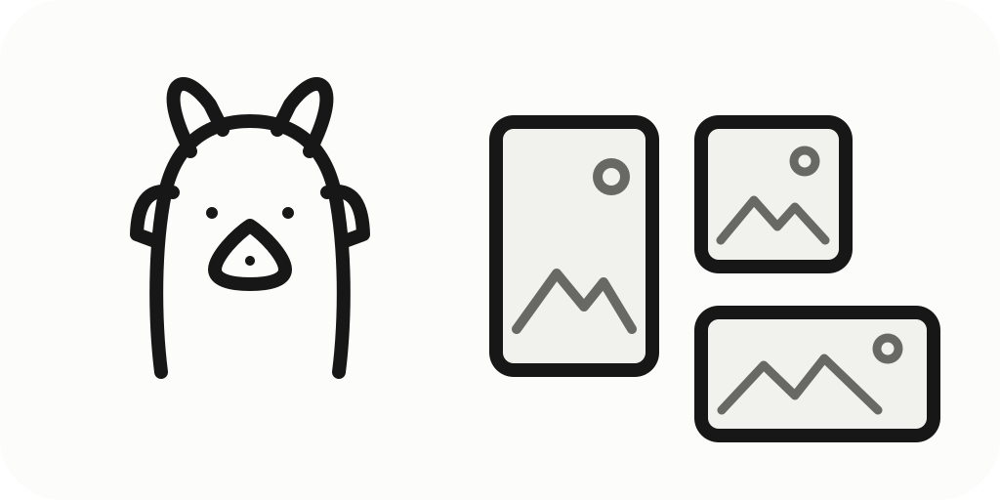

# ComfyUI llama multimodal



[English](./README.md) | [한국어](./README.KO.md)

LLM and multimodal nodes for ComfyUI.

Pass images of different sizes, video, and audio to multimodal LLMs through `llama.cpp`, with control over model loading and generation settings. Limited support for `CLIP` and `Ollama` is also available.

Useful for writing video prompts, describing media, and translating text.

## Supported Runtimes

* `llama.cpp`: Connect to an HTTP(S) server or use the `llama` executable on your `PATH`.
* `CLIP`: Basic support for ComfyUI CLIP models with media of different resolutions.
* `Ollama`: Basic support for multiple images. Audio and video are not supported.

If `llama` is not on your `PATH`, download it from Settings → llama-multimodal → Download llama.cpp.

For local GGUF models, place the model and its matching multimodal projector (`mmproj`) in `ComfyUI/models/LLM`.

Image, video, and audio support depends on the selected model.

## Examples


[Download workflow](./workflows/llamacpp_vision.json)

Generate text from multiple media inputs using a vision LLM.

More examples are available in [EXAMPLES.md](./workflows/EXAMPLES.md).

## Install

Requires ComfyUI 0.19.3 or later.

* ComfyUI Manager

Search for `llama multimodal` and install `ComfyUI-llama-multimodal`.

* Comfy CLI

```sh
comfy node install ollama-image-list
```

* Manual install

```sh
cd ComfyUI/custom_nodes
git clone https://github.com/craftingmod/ComfyUI-llama-multimodal.git
```

## Development

After cloning the repository as described under Manual install, open the repository directory and run:

```sh
uv venv .venv
./.venv/Scripts/Activate
uv sync
bun install
```

Then build the frontend:

```sh
bun run build
```

More scripts are available in [package.json](./package.json).
